# portfolio-prep

Repo for the preparation of my portfolio

## A two or three word catchy title. Do NOT use cliches like “programming ninja” or “coding rockstar”

C3 - Cisco's Coding Corner

## A personal headline, like you have atop your LinkedIn page. What do you want your career to be about?

Process Engineer; Inspiring Software Developer

## Your professional pitch: You’ve done a recording, so just write down here how it goes

Hi, I'm Cisco, and I became a software developer to be at the center of complex problems. With my background in biochemistry, psychology, and mechanical engineering, I bring a unique perspective to my work as a software developer.

As someone who thrives on solving complex problems, I'm excited to be in a field that constantly presents new challenges and opportunities to innovate. I believe that my interdisciplinary background equips me with a well-rounded perspective that can help me to create innovative solutions in a variety of industries.

My passion for problem-solving is matched by my commitment to ongoing learning and growth. I'm always looking for new technologies and techniques to enhance my skills and stay ahead of emerging trends. I'm excited about the potential of software to transform industries and improve people's lives, and I'm eager to be a part of that change.

As a software developer, I'm committed to creating solutions that make a positive impact on the world. Whether it's developing software for healthcare, manufacturing, or any other industry, I'm confident that my skills and experience can help me to make a meaningful difference.

## What excites you the most about tech? Write 1-2 sentences

I have had experience in a variety of industries and say that none have excited me more than tech. Being part of one of the most innovative industries excites me.

## A head shot of your wonderful face, approximately 200x250 pixels

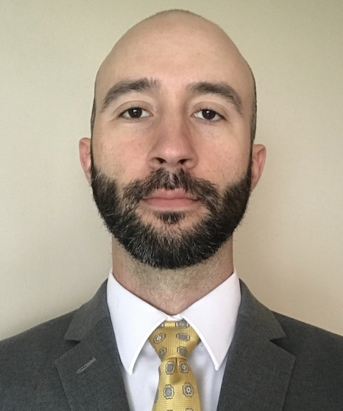

## A background image, approximately 1500x700 pixels

## At least three screenshots of the best-looking parts of a previous project, like your Code 201 final project

### ByteSize Adventurez

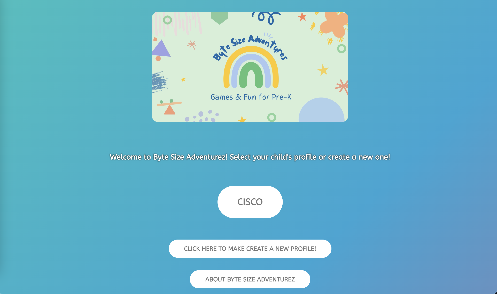

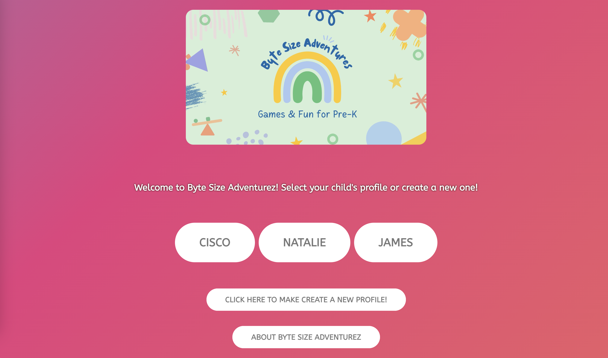

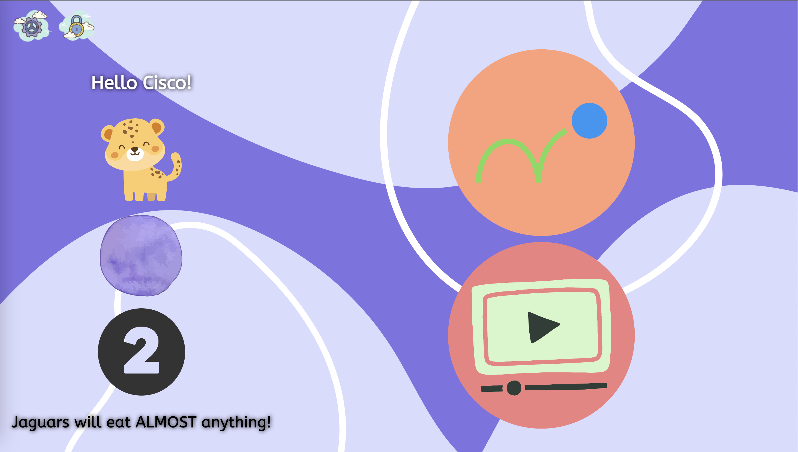

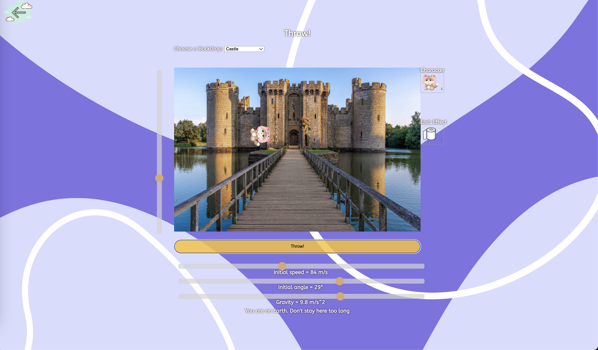

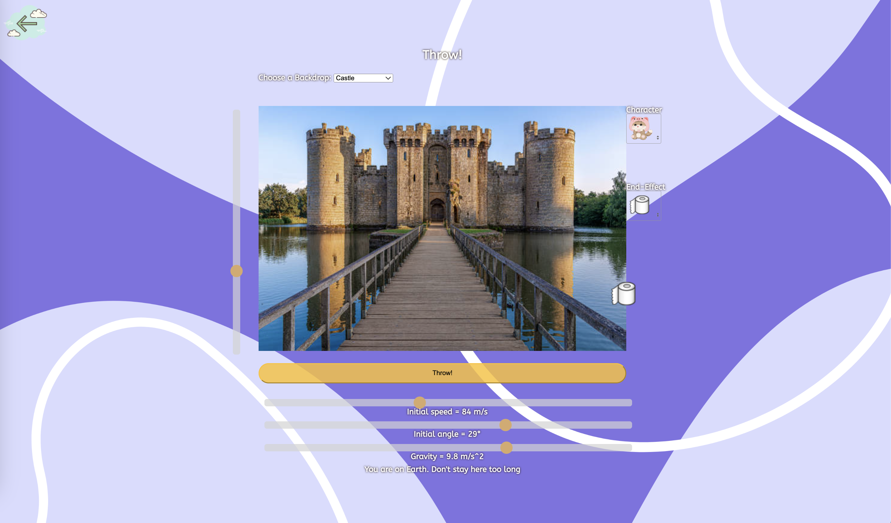

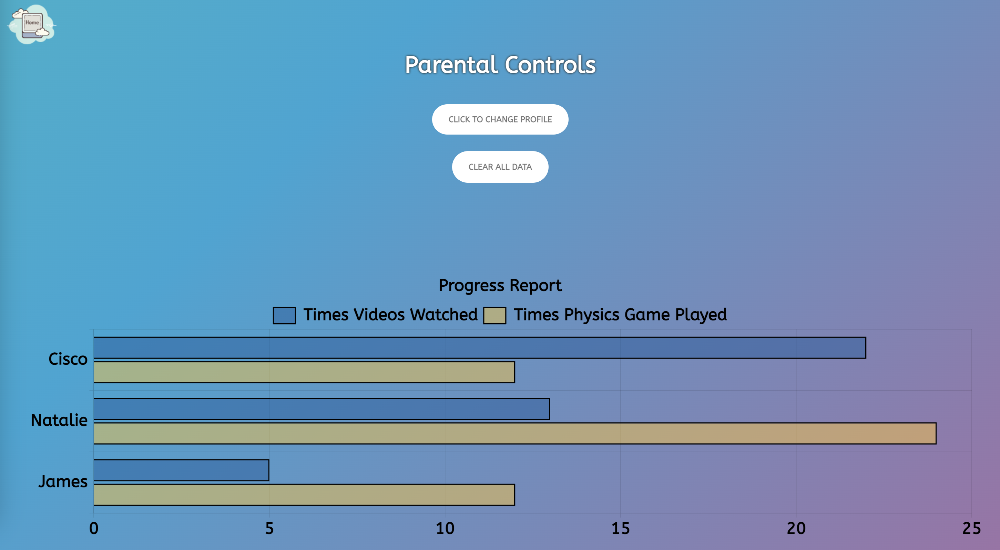

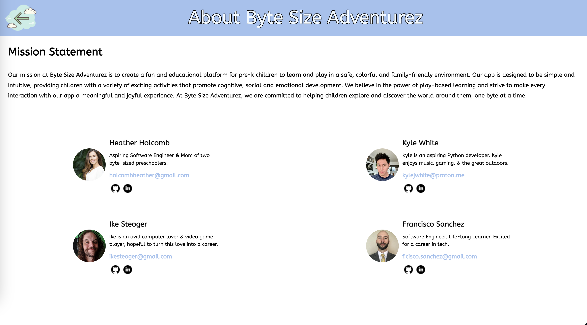

## At least three screenshots each, of two other projects you have worked on. Salmon Cookies? Odd Duck?

### Odd Duck

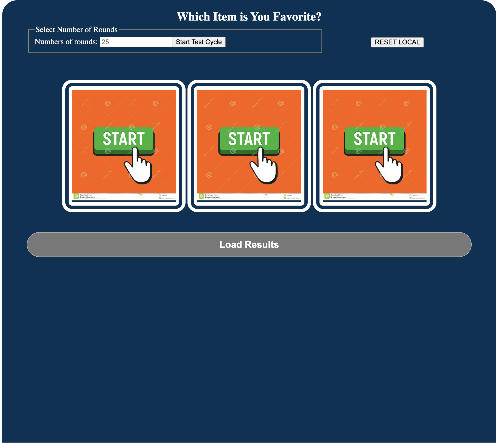

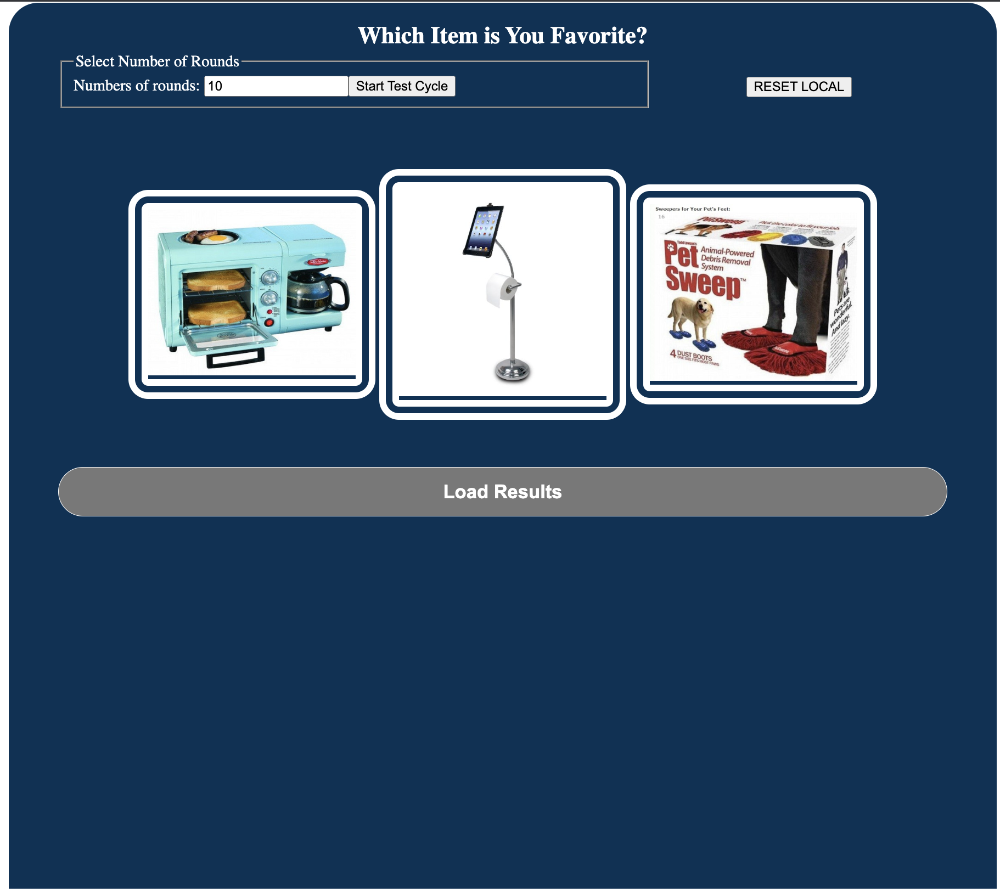

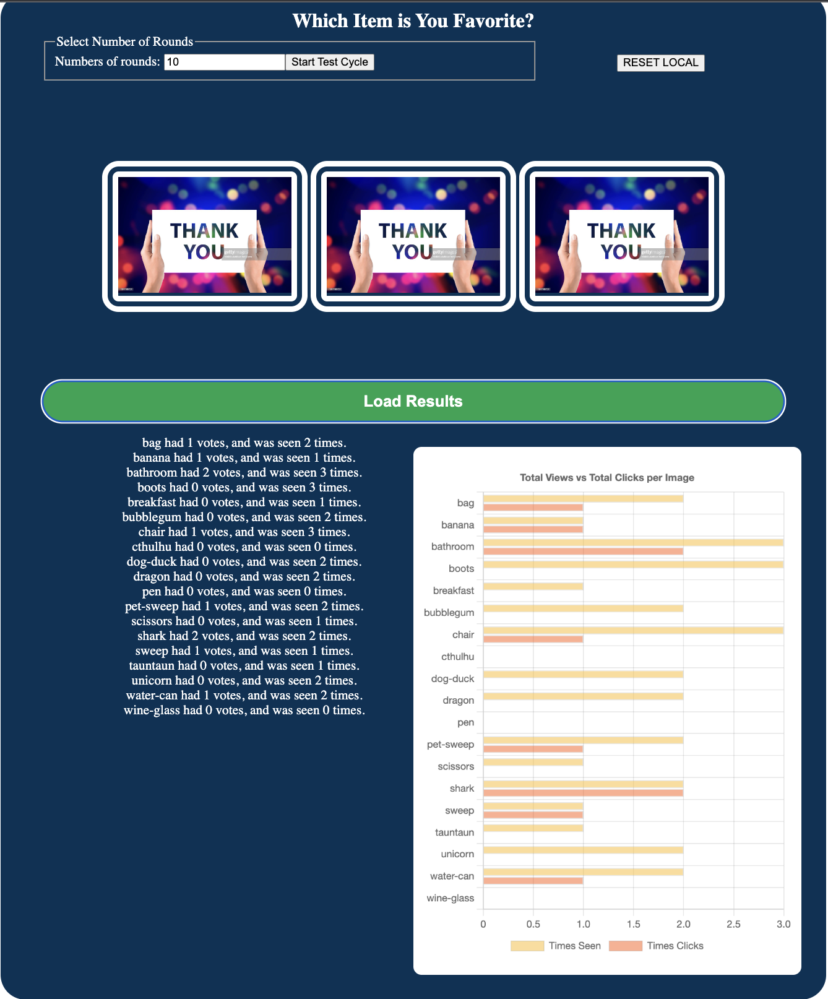

### Pat's Salmon Cookie

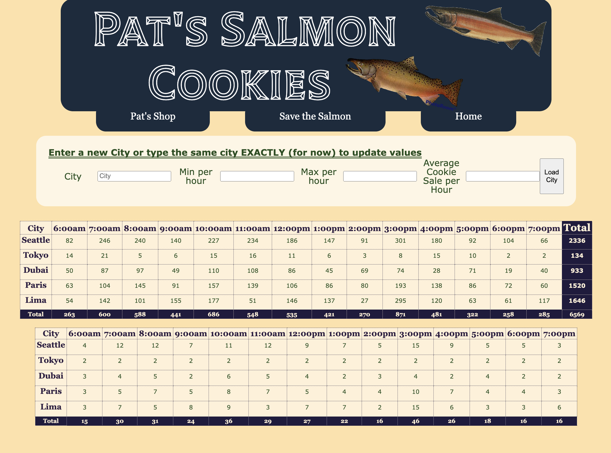

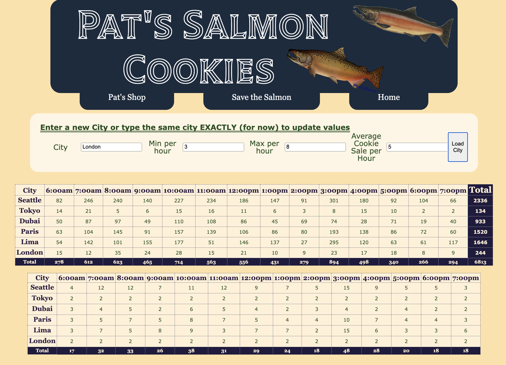

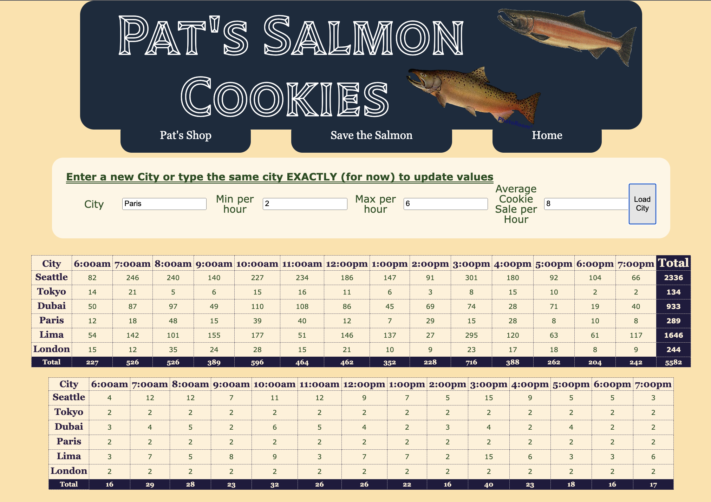